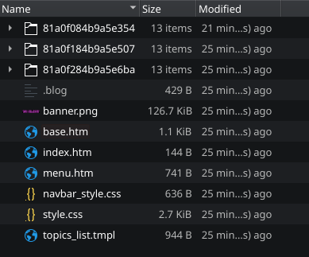
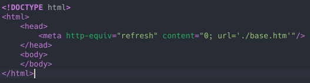
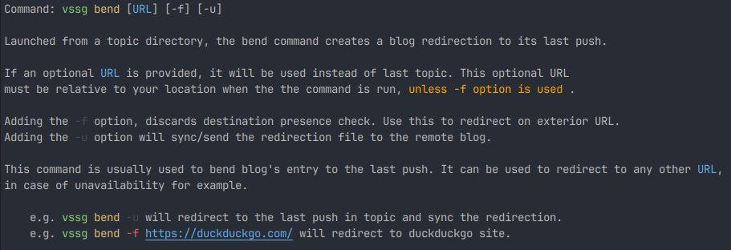

# The bend command: always point on the last article:

Sometimes, we want our main site page shows our last article sent.  To do this, without
dynamic feature, vssg uses redirection. Here is a concrete example, with a site with 3
topics. Its file hierarchy is as this:

- The 3 topics directories.
- the .blog file containing data about these topics.
- base.htm file : This file contains the HTML page listing the topics using topics_list template.
- index.htm file: The root html file contains a redirection:

- Other files are common site  html, css and template files.

To update the index.htm redirection file we use the command **vssg bend**

