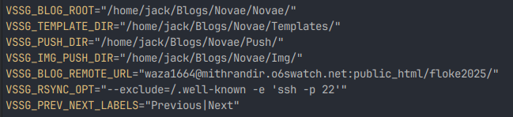
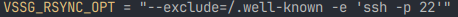

# Environment variables

**vssg** uses 7 environment variables.

VSSG expect several environment variable to be set before running commands. These variables must be set BEFORE
running commands.

**A good idea is to put export commands in your .bashrc (or other) file, or in a script you can run (source) before using vssg.**

**VSSG_BLOG_ROOT** : This is the most important variable here. The absolute path of your blog directory. Should
end with the os path separator '/' to indicate its directory nature. The vssg init 'xxx' command will create a
sub-directory at your location. The VSSG_BLOG_ROOT must point there.

**VSSG_TEMPLATE_DIR**: This variable must contains the absolute path where the templates are taken from.
It should end with a '/' indicating it's a directory. In this directory, you should copy your templates.
To start, you can copy templates in vssg tests_files, and adapt them. There names are hardcoded and must be
conserved.

**VSSG_PUSH_DIR**: This variable must contains the absolute path where the push files will be loaded from, when
using push or modify command. All push files are taken from this directory. It should end with a '/' indicating
it's a directory.

**VSSG_IMG_PUSH_DIR**: This variable is the blog source of images. Images, referenced in push file are taken here,
before being moved into ./pictures/ directory of pushes. It should end with a '/' indicating it's a directory.

**VSSG_BLOG_REMOTE_URL**: This variable indicates the remote blogs directory, in rsync format:
- /home/John/Blog/   if remote URL is a local directory (useful for tests).
- name@domain.com:distant_dir  in case of SSH access.

**VSSG_RSYNC_OPT** : Default synchronization rsync options are --delete -avzhrc but sometimes its required to provide
an additional option. That's why this environment variable exists. My hosting requires a SSH access on port 22, with a directory to
keep untouched (.well-known) so here is my VSSG_RSYNC_OPT:

**VSSG_PREV_NEXT_LABELS** : The chain commands creates links to previous and next push inside a topic. This variable is
here to allow override of default values. The expected string format is Previous label and Next label separated with the
pipe symbol '|'. Example:  "Before|After", "Previous article|Next article".

[[Back to documentation]](../README.md)
