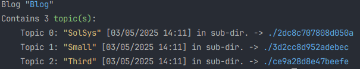
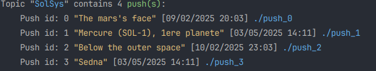
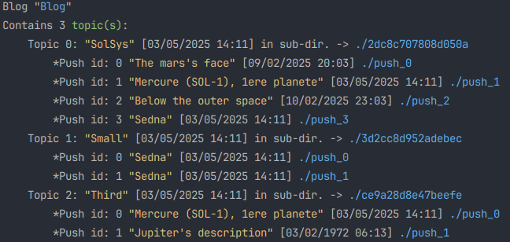

# The blog hierachy:

The blog file hierarchy is frozen and will always be the same:

- 1 blog root (here Blog/)
- 1 to N Topics (name hashed e.g. 2dc8c707808d050a/)
- 0 to N pushes (named push_X with a single pictures sub directory.)

## The .blog file:

This file is in the blog's root directory, is unique and should not be edited. **vssg** uses it to keep
track of all topics within the blog. The file is easily understandable, with [1746281460] representing
a Unix date, seconds since epoque.

**Title - Unix date - Comment**

## The .topic file:
Topic files are in each topic directory. This file is also unique, and should not be edited. **vssg**  uses
it to keep track of pushes within the topic. The file is still easily understandable:

**ID - Title - Unix date - Directory**

These files are the only ways to keep track of the blog's structure. Many commands operates differently when
run from blog directory, or topic directory. For example **vssg show**

From blog directory show the available topics:

From a topic directory show the available pushes:

**vssg show -a** from blog directory shows the whole hierarchy:

