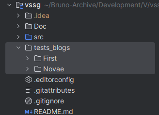
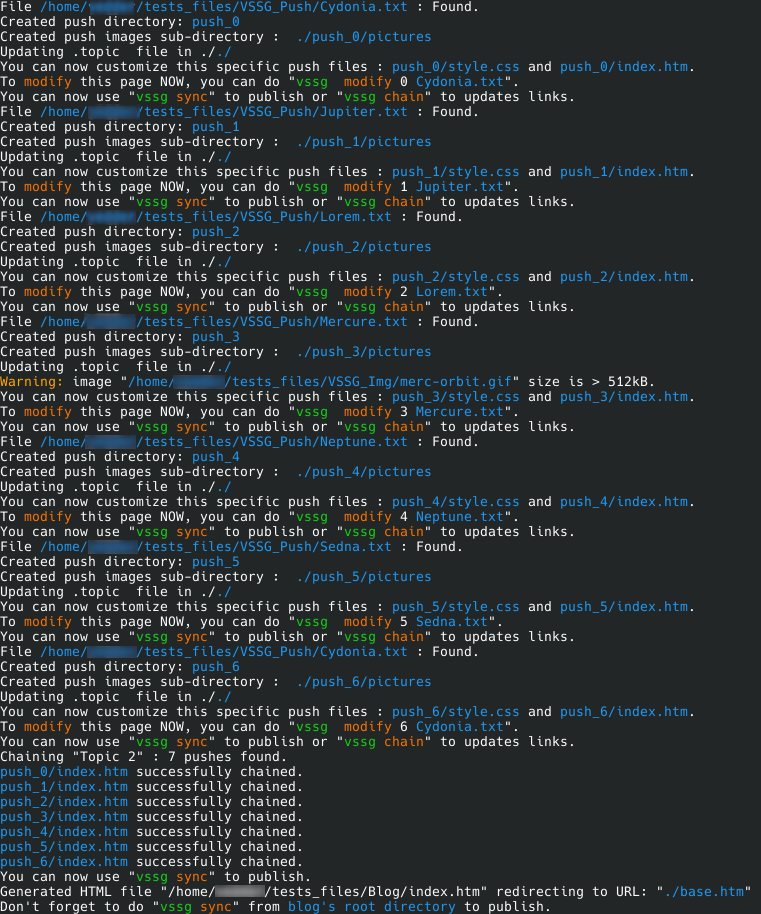
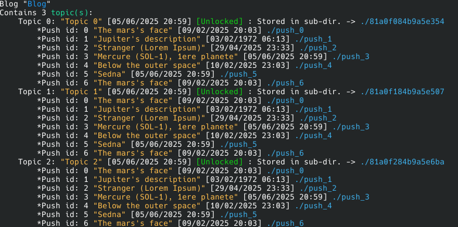
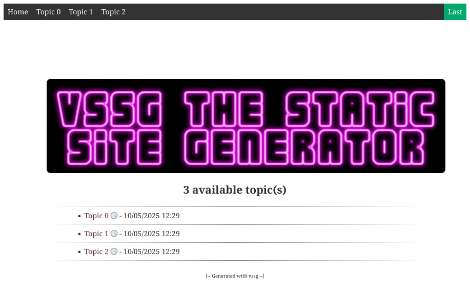
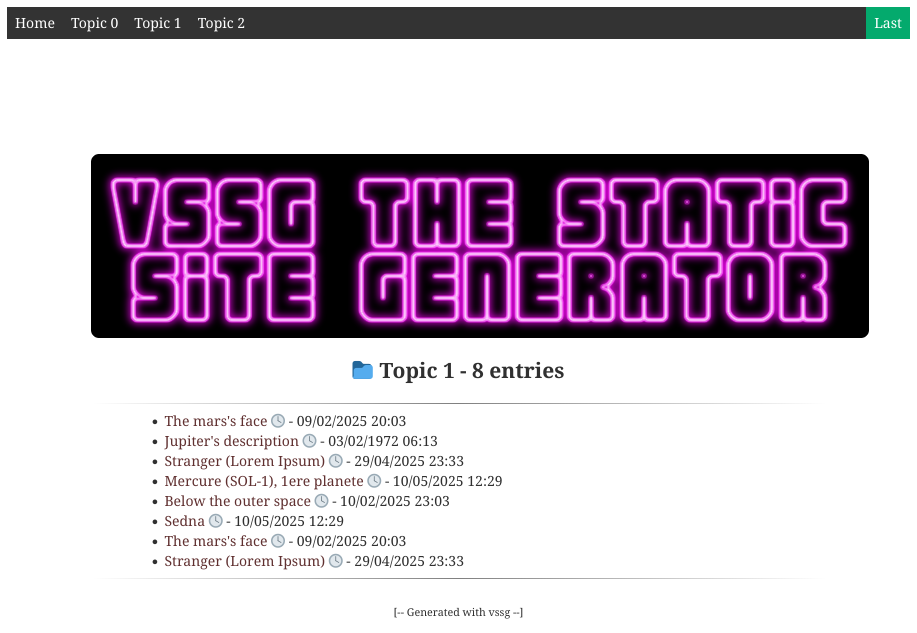
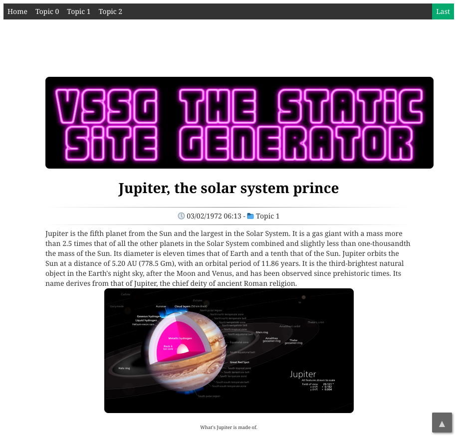
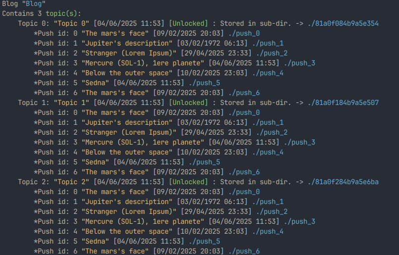

# Playground - The test blog

Sometimes, a simple example is better than a long explanation. For this, you'll find a 2 toys blogs in the tests_blogs
directory. Before all, we assume that you have build vssg, and that the executable is in your $PATH, runnable from
any location.

To generate the toy blog, you can copy the whole the tests_blogs directory where you want.



Then enter in the copied tests_blogs directory choose (cd) First or Novae examples. You'll find a script named build.sh
that contains commands to build to blog. First, check that the script build.sh is **executable**. if not
execute chmod +x build.sh

Now you can **source** (don't simply run build.sh) the file by running:
```
source ./build.sh
```
or
```
. ./build.sh
```

Both command are equivalent. Many commands are executed by the script to build the toy blog.



Just ignore  the last statement about sync command. Here is the typical output when generating the 'First' example
blog:

At this point, you should have a new directory called Blog, with 3 topics and several (repeted) push inside,
fully browsable. The script also has exported  mandatory environment variable (**vssg env** to display them) that allow
you to run vssg commands. Now you can enter the Blog (using cd Blog) and start to play with vssg command.

**Warning:** The exported variable will be set until you close your terminal. To make them permanent, add them in your
.bashrc file.

**vssg show -a**   should show this:



Now you're ready to experiment vssg commands. Should you break something, just delete the Blog directory, or as last
solution, remove the tests_files directory and start again from a new copy.

Now, opening with your favorite browser the Blog/index.htm file you can browse the toy blog:

### The topic list:




### The pushes list:




### A push example*:



#### *Text and Images source: [Wikipedia](https://en.wikipedia.org/wiki/Main_Page)

Enter the Blog directory by doing cd Blog, and then running 'vssg show -a' you should get:



You can now have a look at all vssg command, and try updating and customizing things.

- [All vssg commands](AllCommands.md)

[[Back to documentation]](../README.md)
