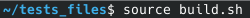
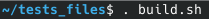

# Playground - The test blog

Sometimes, a simple example is better than a long explanation. For this, you'll find a toy blog in the tests_files
directory. Before all, we assume that you build vssg, and that the executable is in your $PATH, runnable from any
location.

To generate the toy blog, you can copy the whole the tests_files directory where you want.

Then enter in the copied tests_files directory check that the script build.sh is executable. if not
execute chmod +x build.sh

Now you can **source** (don't simply run build.sh) the file by running:

or

Both command are equivalent. Many command are executed by the script to build the toy blog.

Just ignore  the last statement about sync command.

At this point, you should have a new directory called Blog, with 3 topics and several (repeted) push inside,
fully browsable. The script also has exported  mandatory environment variable (**vssg env** to display them) that allow
you to run vssg commands. Now you can enter the Blog (using cd Blog) and start to play with vssg command.

**Warning:** The exported variable will be set until you close your terminal. To make them permanent, add them in your
.bashrc file.

**vssg show -a**   should show this:

Now you're ready to experiment vssg commands. Should you break something, just delete the Blog directory, or as last
solution, remove the tests_files directory and start again from a new copy.

### The topic list:

### The pushes list:

### A push example*:

#### *Text and Images source: [Wikipedia](https://en.wikipedia.org/wiki/Main_Page)

Enter the Blog directory by doing cd Blog, and then running 'vssg show -a' you should get:

From there you can add a push in Topic 1 by doing:
cd ./81a0f184b9a5e507
vssg push Lorem.txt

Link the pushes between them :

vssg chain

Bend the redirection to the last entry (this Lorem.txt)

vssg bend

At anytime you can browse the Blog by opening a .htm file in your browser.

You can now have a look at all vssg command, and try updating and customizing things.

- [All vssg commands](AllCommands.md)

[[Back to documentation]](../README.md)
