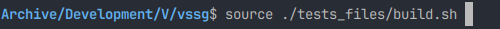

# Playground - The test blog

Sometimes, a simple example is better than a long explanation. For this, you'll find a toy blog in the tests_files
directory.

This directory contains all needed files to generate a toy project blog, and start using vssg's commands.

In order to build it, you have 5 thing to do:

- export VSSG_PUSH_DIR= **xxx**/vssg/tests_files/VSSG_push/
- export VSSG_PUSH_DIR= **xxx**/vssg/tests_files/VSSG_Img/
- export VSSG_BLOG_ROOT= **xxx**/vssg/Blog

where **xxx** is the absolute path from / to the location you have installed vssg.

Note that :
- these variables must be exported before running the build.sh script.
- vssg executable must be aliased or in you PATH (export PATH=$PATH:/....containing vssg executable)

Then you can source the build script from vssg root directory:

or

Both command are equivalent.
Then, you should end with a new directory called Blog, with 3 topics and several (repeted) push inside, fully browsable.

Enter the Blog directory by doing cd Blog, and then running 'vssg show' you should get:

From there you can add a push in Topic 1 by doing:
cd ./81a0f184b9a5e507
vssg push Lorem.txt

Link the pushes between them :

vssg chain

Bend the redirection to the last entry (this Lorem.txt)

vssg bend

At anytime you can browse the Blog by opening a .htm file in your browser.

You can now have a look at all vssg command, and try updating and customizing things.

- [All vssg commands](AllCommands.md)
