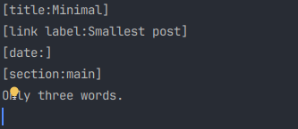

# Pushing

Push and Modify are two major commands of **vssg**.

These commands must be launched from the topic's directory you want to update. In order to use them
both VSSG_PUSH_DIR and VSSG_IMG_PUSH_DIR must be set.

vssg push Saturn.txt : Saturn.txt is the push_text_file. will load the push file from the directory pointed by
VSSG_PUSH_DIR. Images (if any) referenced in the Saturn.txt file will be searched (copied) from the VSSG_IMG_PUSH_DIR path.

An exemple of minimal push file:

- **title**: mandatory, is the title of your push.
- **link label**: optional, is the link to your push in push list of the topic.
- **date**: optional : specify the date ('DD/MM/YYYY HH:mm') or it will be set to actual time.
- **sections...** : mandatory, section name should match your push template. Your template will be used to generate
  the push HTML page, and [section:...] in your push, will be substituted with this text section.

You can have as many section as you want in your push template. They all will be substituted with the corresponding
section text in your push file. Nevertheless, refering to an non existing section in your push text will generate an
error.

In push_text_file, images are provided like this:

[img:merc2.jpg:"Pole sud de Mercure"] : Picture name, followed by optional comment
[img:Jupiter_2.jpg] : An image without comment.

Only the filename is provided as path is taken from the VSSG_IMG_PUSH_DIR environment variable.

