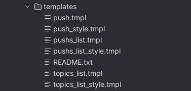
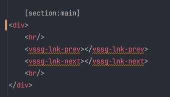
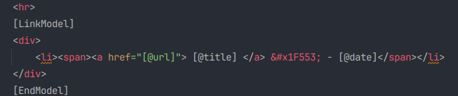

# Templates:

There are three templates files used by vssg:
- push template : used as model for each push.
- push list template: used to generate the page listing pushes in the topic.
- topic list template: used to generate the page listing all topics in blog.

These files, all have an associated css style file, are embedded inside the **vssg** executable and located
in src/templates:

This allow me to keep only a simple executable instead of a bunch of files, dependant to filesystem, at cost
of recompilation. When the templates are modified, the vssg executable should be recompiled.  Note that these
templates will be deployed inside the blog, for further customization (if any). It's good idea to work on
these files, and copy them back in templates directory when satisfied.

## Push template: push.htm:

This file is a regular HTML file. It's only specificity is one or more  [section:xxx]. This  [section:xxx]
where xxx could be any unique name, will be later substituted to the corresponding text, in the text file
given as parameter of push/modify command. This allows to place blocs of text where you want.

The template could embed 2 specials tags:

That will be replaced by links to previous and next push (if any) by the **vssg chain** command. Theses tags are optional.

The last specificity of the template is the availability of 3 dynamics variables substituted, at push time by their
corresponding values:

- **[@topic]** : The name of containing topic.
- **[@date]** : The date of the push.
- **[@title]** : The title of the push.

## Push List template: pushs_list.htm:

This file is a template for generating a HTML page with link to various pushes in the blog. The template file MUST
provide a special section between [LinkModel] and [EndModel] tag:

This section is the HTML model that will be used
to generate any links in the push list page. It recognizes 4 dynamic variables, substituted on push time:

- **[@url]** : The url of the push page.
- **[@date]** : The date of the target push.
- **[@title]** : The title of the target push.
- **[@num]** : The number of pushes in the topic.

## Topic List template: topics_list.htm:

This page is working the same way push list does. It here to allow different customization of push list page.

