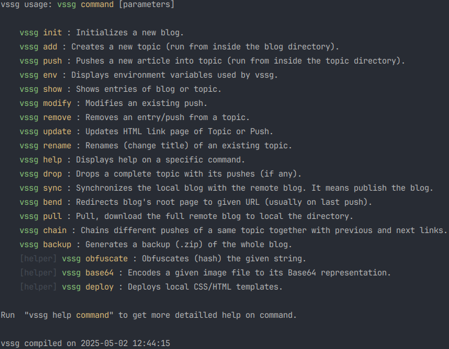

# VSSG is a static site generator

The Static Site Generator (SSG) is written in new language v. This language can be found [here](https://vlang.io/). V language
is fast and very well suited for any application. The language is quite simple, elegant and avoid most of syntactic noise.
This leads to a great code concision and a very easy to learn language.

The project aims to have zero dependencies:
- No database link, replaced by minimalistic ASCII files.
- No PHP or other dynamic scripts.
- No javascript / framework dependencies.
- No CMS.
- Only HTML and CSS

**vssg** is command line driven, and almost fully self documented. All operations are done via command
line. The project is very Linux, developer centric, and I won't make any effort to support MS Windows.

The SSG was written for my personal need, and doesn't aim to be widely used. It is provided as is, with hope to
be useful for others people. The project is released under MIT license, as most of V projects

## Three concepts of vssg:
vssg recognize only three concepts:

- The Blog: A blog, denoted by it's directory. It contains 1 to N topics.
- Topics: 1 to N exists in the Blog. Topics are similar to forum Topics/Threads, denoted as blog's sub-directory.
- Pushes: 0 to N Pushes inside a Topic directory. Each push is an HTML page, in a topic sub-directory.

## Quickstart guide:
### 0) Grab and install V lang from [V repository](https://github.com/vlang/v).

Then grab vssg sources and in the main directory (the one that contains the v.mod) file run v .
This will compile vssg executable. You should alias or put is in your $PATH env variable.

### 1) Init the blog with the command:
In your favorite terminal type "vssg init Blog"  (vssg must be in your $PATH)

 

It's **strongly** suggested to export the absolute path of your blog to VSSG_BLOG_ROOT environment variable.
This variable will be used by many commands.

### 2) Add few topics to the Blog:
First, **you must move in your blog directory**. All vssg commands are relatives to the
location the commands are launched from. Two locations are known: Blog's root, and Topic directory.

Launch the "vssg add SolSys" to add a Topic in your blog.

The command traces its actions, and guides you for customization. Here, add deploys several css and
template files to be customised before pushing pages. Note that the topic's name is hashed (fnv1a algorithm) to generate
a directory name. Here SolSys topic is held in 2dc8c707808d050a directory.

you can perform a "vssg show" to list topics, from blog's directory:

### 3) Insert a push into a given topic.
To insert a push in a specific Topic, just move (cd) into the Topic directory. To retrieve the topic hashed name
just perform a "vssg show" (see above). The pushes are provided through text files (format specified later). These
files are typically grabbed from a location specified by the VSSG_PUSH_DIR, setup via export VSSG_PUSH_DIR="Absolute dir path".

Environment variable used by vssg can be shown with "vssg env" command.

Then, from topic's directory

Just perform "vssg push Jupiter.txt" (provided Jupiter.txt exists in the directory pointed by VSSG_PUSH_DIR)

